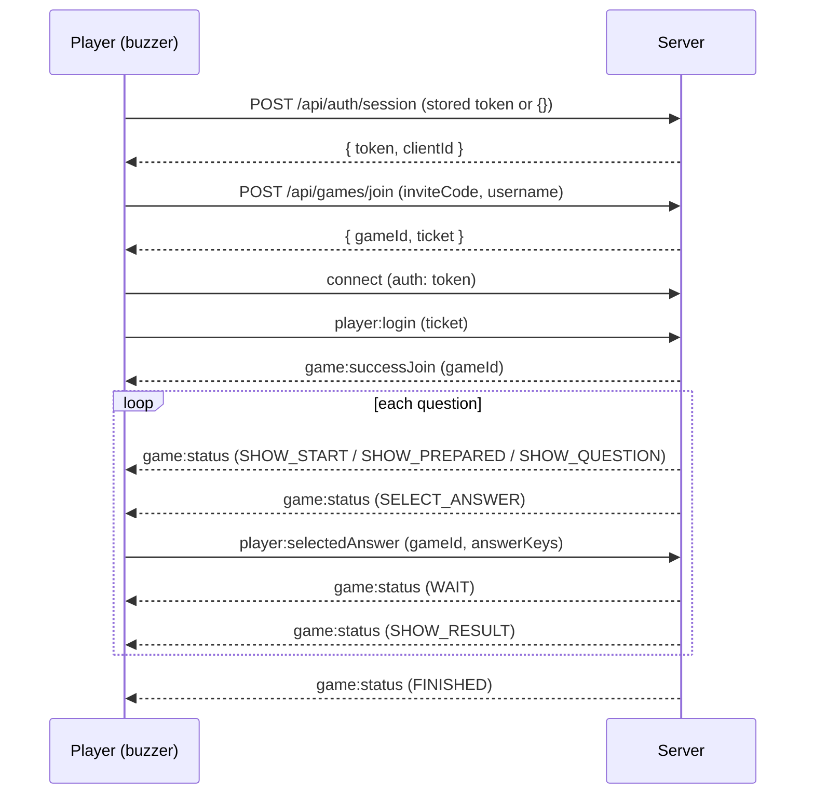
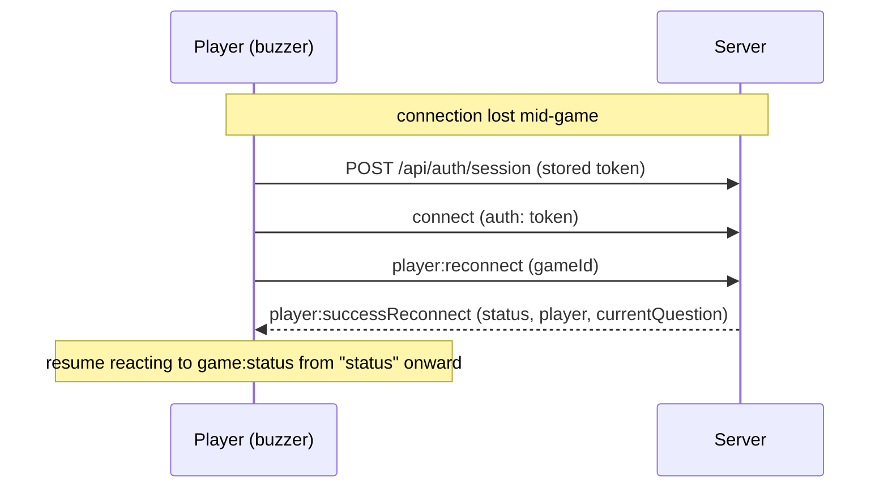

# WebSocket protocol

Razzia's live game communication runs over [Socket.IO](https://socket.io/), on the `/ws` path. Everything that is not live game state — identity, quiz storage, results, game creation — is a plain HTTP API under `/api` (see [HTTP API](http-api.md)). This document describes the **player-facing** part of the socket protocol, so you can build an alternative client, for example firmware for an ESP32-based physical buzzer for kids, instead of using the web UI.

A custom client now makes **one HTTP call before connecting**, to obtain a session token.

> This protocol is internal and not version-stabilized. It can change between releases without a deprecation period. Check this file against the version you deploy.

## Connecting

The handshake carries a **signed session token**, not a self-declared id. Get one once and persist it (e.g. in an ESP32's NVS flash):

```
POST /api/auth/session   {}          ->  { token, clientId, role, expiresAt }
POST /api/auth/session   { token }   ->  the same token, while it is still valid
```

Then connect:

```js
io("http://<host>:<port>", {
  path: "/ws",
  auth: { token },
})
```

- The token's `clientId` is the identity the server trusts: it is what lets a player rejoin their seat after a disconnect (Wi-Fi drop, reboot, etc). Reconnecting with the same token triggers the reconnect flow instead of creating a new player. A `clientId` you generate yourself is no longer accepted.
- Player tokens last 30 days. **Re-POST the stored token to `/api/auth/session` before every connection**: an unexpired token comes back unchanged, and an expired one is replaced by a fresh token carrying the same `clientId`, so the seat survives.
- Anyone who knows a 6-character invite code can still join a room, so treat the invite code as a room key.
- The server doesn't override Socket.IO's default keepalive (`pingInterval` 25s / `pingTimeout` 20s). Your client library needs to answer Engine.IO pings within that window or it will be dropped as disconnected.

### Handshake rejections

If the token is missing or unusable the connection is refused with `connect_error`. The error carries `message` (an i18n key) and `data.code`:

| `data.code`     | Meaning                                                | What to do                                      |
| --------------- | ------------------------------------------------------ | ----------------------------------------------- |
| `TOKEN_MISSING` | No `auth.token` was sent                               | Call `POST /api/auth/session`, then reconnect   |
| `TOKEN_EXPIRED` | Valid signature, past `exp`                            | Re-POST the token to refresh it, then reconnect |
| `TOKEN_INVALID` | Bad signature or malformed (e.g. the server restarted) | Discard it, POST an empty body, then reconnect  |

> **Socket.IO does not retry after these.** The transport itself connected, so the client marks the namespace inactive and stays disconnected until _you_ call `connect()` again. Cap your retries (the web client allows two) so a permanently failing mint cannot spin.

The token is verified **only at the handshake**, never per event, so a token that expires mid-game does not interrupt the game.

## Message envelope

Most client -> server events take a plain payload. Events tied to an active game take an object with a `gameId` and, for a few of them, a nested `data`:

```ts
{ gameId: string, data: { ... } }
```

Server -> client game state updates arrive on a single event, `game:status`, shaped as:

```ts
{ name: Status, data: StatusDataMap[Status] }
```

where `name` is one of the status constants below and `data` is the payload for that specific status.

## Joining a game as a player

1. **Check the PIN** (optional, used by the web UI to validate before showing the join form). No authentication needed:

   ```
   POST /api/games/check   { "inviteCode": "..." }
   ->  { valid: boolean }
   ```

2. **Ask for a seat over HTTP**, with your session token as a bearer:

   ```
   POST /api/games/join   { "inviteCode": "...", "username": "..." }
   ->  { gameId, ticket }
   ```

   - `username` must be 1-20 characters ([validators/auth.ts](../packages/common/src/validators/auth.ts)).
   - The **ticket** is a short-lived (5 min) signed proof that you passed the invite code and that this username was accepted. It is bound to your `clientId`: another client cannot use it.
   - `ticket` comes back `null` when you already hold a seat in that game — skip step 3 and go straight to [Reconnecting](#reconnecting).
   - Errors: `404 errors:game.notFound` (unknown code), `403 errors:game.managerCannotJoin`, `400` with a validation key, `401 errors:auth.unauthorized` (no bearer).

3. **Present the ticket on the socket.** This is what creates the seat and binds it to this connection:

   ```
   emit player:login { ticket }
   ```

   - `on game:successJoin <gameId: string>`: you're in. The server also emits `manager:newPlayer` to the manager and `game:totalPlayers <count>` to everyone in the room.
   - `on game:reset <key: string>`: the ticket is expired, forged, or was minted for another client (`errors:auth.joinTicketInvalid` / `errors:auth.unauthorized`), the game is gone, or this `clientId` already has a player. Go back to step 1.

From here, wait for `game:status` events and react to the `name` field.

> The seat is created by step 3, not step 2: a ticket you never present leaves no trace on the server.

## Game status flow

The manager drives the game through a fixed sequence of statuses, broadcast to every player via `game:status`. A single button/buzzer client mainly cares about `SELECT_ANSWER` (when it should accept a button press) and `SHOW_RESULT` (whether that press was correct).

| Status          | Player payload (`data`)                                                                                                   | What it means                                                                                                                                                                                              |
| --------------- | ------------------------------------------------------------------------------------------------------------------------- | ---------------------------------------------------------------------------------------------------------------------------------------------------------------------------------------------------------- |
| `SHOW_START`    | `{ time: number, subject: string }`                                                                                       | Countdown before the quiz starts.                                                                                                                                                                          |
| `SHOW_PREPARED` | `{ totalAnswers: number, questionNumber: number }`                                                                        | "Get ready" screen before a question is shown, tells you how many answer options this question has.                                                                                                        |
| `SHOW_QUESTION` | `{ question: string, media?, cooldown: number }`                                                                          | The question text is shown; answers are **not** accepted yet. `cooldown` is how many seconds until answers open.                                                                                           |
| `SELECT_ANSWER` | `{ question, answers: string[], media?, time: number, totalPlayer: number, questionType: "single" \| "multi", options? }` | Answers are open. `answers.length` tells you how many buttons are relevant (2-4). `time` is the number of seconds to answer. `questionType` is `"single"` (one correct button) or `"multi"` (one or more). |
| `SHOW_RESULT`   | `{ correct: boolean, message: string, points: number, myPoints: number, rank: number, aheadOfMe: string \| null }`        | Whether your submitted answer was correct, points earned, and your new total/rank.                                                                                                                         |
| `WAIT`          | `{ text: string }`                                                                                                        | Generic waiting screen (e.g. after answering, waiting for other players or for the manager to continue).                                                                                                   |
| `FINISHED`      | `{ subject: string, top: Player[], rank?: number }`                                                                       | Game over; final leaderboard.                                                                                                                                                                              |

Other useful events while a game is in progress:

- `on game:updateQuestion { current: number, total: number }`: question index changed.
- `on game:totalPlayers <count: number>`: number of players in the room changed.
- `on game:reset <key: string>`: the session is no longer valid (manager left before start, you were kicked, game expired, etc). Treat this as "go back to the join screen."

## Submitting an answer

Only valid while the current status is `SELECT_ANSWER`, and only the **first** submission per question counts, submitting again is silently ignored:

```
emit player:selectedAnswer { gameId, data: { answerKeys: number[] } }
```

- `answerKeys` are 0-based indices into the `answers` array received in `SELECT_ANSWER`. For a `"single"` question, send a one-element array, e.g. `[1]` for the second button. For `"multi"`, send every button pressed, e.g. `[0, 2]`.
- Points are time-weighted (faster correct answers score higher), computed server-side from `time` and when you answer relative to the start of the answer window.
- After submitting, expect `data: { text: "game:waitingForAnswers" }` on the `WAIT` status, then `SHOW_RESULT` once the question closes (time runs out or every player has answered).

This is the one event a 4-button ESP32 buzzer needs to send: map each physical button to an answer index and emit this event on press, once, while in `SELECT_ANSWER`.

## Reconnecting

If the socket disconnects (`disconnect` event fires implicitly, no action needed client-side) and reconnects, refresh the token (`POST /api/auth/session` with the stored one — the `clientId` is preserved), reconnect with it, and call:

```
emit player:reconnect { gameId }
```

- `on player:successReconnect { gameId, status, player: { username, points }, currentQuestion }`: you're back in, `status` is the current `game:status` payload so you can resume the UI where it left off.
- `on game:reset <key: string>`: the game no longer exists or this player slot is already connected elsewhere, start over from [Joining a game](#joining-a-game-as-a-player).

You need to persist `gameId` and the session `token` across reconnects/reboots to use this (e.g. in the ESP32's NVS flash) — a fresh `gameId` is only handed out by `POST /api/games/join` when first joining.

## Leaving a game

An unexpected drop (Wi-Fi loss, reboot) is handled by the server as a temporary disconnect: no event needed, just reconnect later with the same token as above.

If the player intentionally quits (e.g. a physical "leave" button), emit this instead so the manager sees them go immediately rather than just "disconnected":

```
emit player:leave { gameId }
```

Before the game has started this removes you from the player list entirely; once started, it behaves the same as a disconnect (marked disconnected, seat kept for a potential reconnect).

The same rule applies to an unexpected drop: **before the game starts there is no seat to come back to**, so a reconnect fails with `game:reset errors:game.notFound` and you rejoin from step 1. Once the game is running, the seat is kept.

## Full example

A minimal buzzer runs this sequence once, then just reacts to `game:status` until it sees `SELECT_ANSWER`:



If the socket drops mid-game (Wi-Fi loss, reboot) and comes back, refresh the persisted token and replay it with the persisted `gameId` instead of joining again:



## Reference: all player-relevant events

Full type definitions live in [packages/common/src/types/game/socket.ts](../packages/common/src/types/game/socket.ts) and the constants (exact string values) in [packages/common/src/constants.ts](../packages/common/src/constants.ts).

**Client → Server**

| Event                   | Payload                                      |
| ----------------------- | -------------------------------------------- |
| `player:login`          | `{ ticket: string }`                         |
| `player:reconnect`      | `{ gameId: string }`                         |
| `player:leave`          | `{ gameId: string }`                         |
| `player:selectedAnswer` | `{ gameId, data: { answerKeys: number[] } }` |

**Server → Client**

| Event                     | Payload                                            |
| ------------------------- | -------------------------------------------------- |
| `player:successReconnect` | `{ gameId, status, player, currentQuestion }`      |
| `game:status`             | `{ name: Status, data }`                           |
| `game:successJoin`        | `gameId: string`                                   |
| `game:totalPlayers`       | `count: number`                                    |
| `game:updateQuestion`     | `{ current: number, total: number }`               |
| `game:playerAnswer`       | `count: number` (players who have answered so far) |
| `game:errorMessage`       | `key: string`                                      |
| `game:reset`              | `key: string`                                      |

`key`/`message` string values here are i18n translation keys used by the web UI (e.g. `errors:game.notFound`), not human-readable text — treat them as symbolic error codes and map the ones you care about.

## Manager events

Out of scope for a buzzer client, but worth knowing they are guarded: `manager:startGame`, `manager:nextQuestion`, `manager:abortQuiz`, `manager:showLeaderboard` and `manager:kickPlayer` are **refused unless your token's `clientId` is the one that created that game** through `POST /api/games` — the refusal is `game:errorMessage errors:auth.unauthorized`. Creating a game, quiz CRUD and results are HTTP-only now; see [HTTP API](http-api.md).
